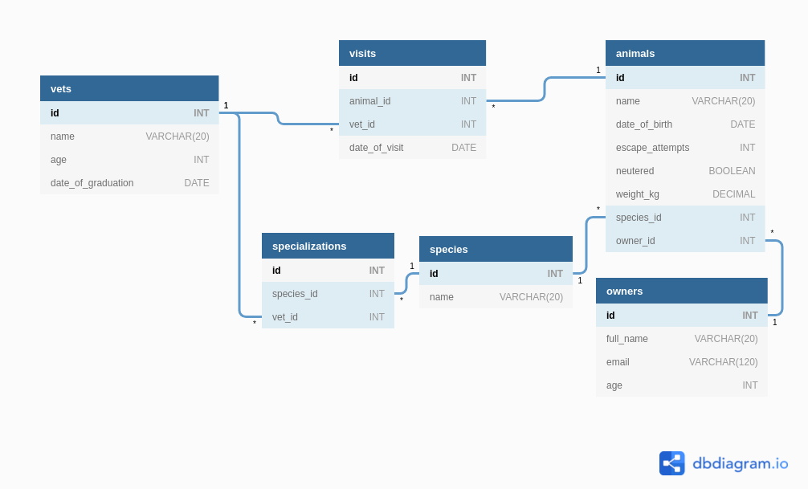

<p align="center">
  <a href="https://www.microverse.org/">
    
  </a>
  <a href="https://github.com/enionsouza/stocks-watcher">
    
  </a>
  <a href="https://github.com/enionsouza/vetclinic-database-optimization">
    
  </a>
</p>

# VetClinic Databas Optimization

## About

In this project, our goal was to perform a PostgreSQL Database Optimization using VetClinic Database, whose original scripts have been provided by Microverse.

Below, we present an ERD representation of the provided database schema:


## Built With

- SQL, PostgreSQL DB (v. 12.8);
- VisualStudio Code, Git, & GitHub;

## Pre-requisites

- PostgreSQL
- Git

## Getting Started

1. In your terminal, in the folder of your preference, type the following bash command to clone this repository:

```sh
git clone git@github.com:enionsouza/vetclinic-database-optimization.git
```

2. Now that you have already cloned the repo run the following commands to get the project up and running:

```sh
$ sudo -u <userName> createdb vetclinic
$ psql -U <userName> -d vetclinic -a -f schema.sql
$ psql -d vetclinic
```

3. For the last step of the process, once you are already in PostgreSQL Shell, you just need to run the following commands to check the improved performance of the database:

```sql
vetclinic=# explain analyze SELECT COUNT(*) FROM visits where animal_id = 4;
vetclinic=# explain analyze SELECT * FROM visits where vet_id = 2;
vetclinic=# explain analyze SELECT * FROM owners where email = 'owner_18327@mail.com';
```

To leave PostgreSQL Shell environment, you can just run `\q` and hit `<ENTER>`.

## Authors

👤 **Eduardo Rodriguez**

- GitHub: [@EroAuditore](https://github.com/EroAuditore)
- Twitter: [@EroAuditore](https://twitter.com/EroAuditore)
- LinkedIn: [EroAuditore](https://www.linkedin.com/in/EroAuditore/)

👤 **Ênio Neves de Souza**

- GitHub: [@enionsouza](https://github.com/enionsouza)
- Twitter: [@enionsouza](https://twitter.com/enionsouza)
- LinkedIn: [Enio Neves de Souza](https://www.linkedin.com/in/enio-neves-de-souza/)

## 🤝 Contributing

Contributions, issues, and feature requests are welcome!

Feel free to check the [issues page](https://github.com/enionsouza/vetclinic-database-optimization/issues).

## Show your support

Give a ⭐️ if you like this project!

## 📝 License

This project is [MIT](./LICENSE) licensed.
